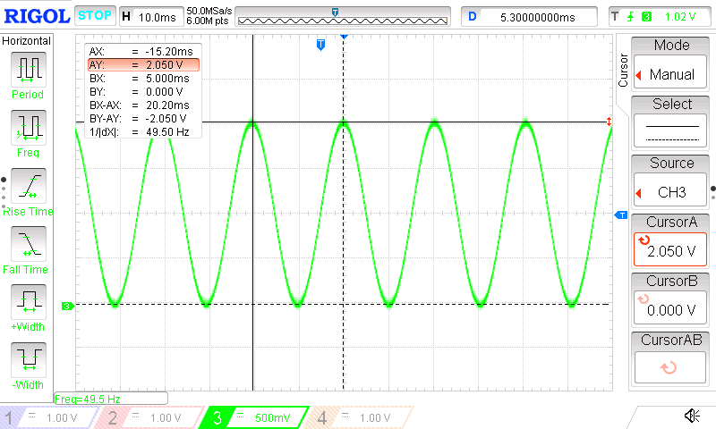

# Generating Sine Wave Signal

This code example shows how to use the Digital-to-Analog Converter (DAC) to generate a sine wave signal.

## Related Documentation
More details and code examples on the AVR128DA48 can be found at the following links:
- [TB3210-Getting Started with Digital-to-Analog Converter (DAC)](https://ww1.microchip.com/downloads/en/Appnotes/TB3210-Getting-Started-with-DAC-90003210A.pdf)
- [AVR128DA48 Product Page](https://www.microchip.com/wwwproducts/en/AVR128DA48)
- [AVR128DA48 Code Examples on GitHub](https://github.com/microchip-pic-avr-examples?q=avr128da48)
- [AVR128DA48 Project Examples in START](https://start.atmel.com/#examples/AVR128DA48CuriosityNano)

## Software Used
- MPLAB® X IDE 5.45 or newer [(microchip.com/mplab/mplab-x-ide)](http://www.microchip.com/mplab/mplab-x-ide)
- MPLAB® XC8 2.31 or a newer compiler [(microchip.com/mplab/compilers)](http://www.microchip.com/mplab/compilers)
- MPLAB® Code Configurator (MCC) 4.0.2 or newer [(microchip.com/mplab/mplab-code-configurator)](https://www.microchip.com/mplab/mplab-code-configurator)
- MPLAB® Code Configurator (MCC) Device Libraries 8-bit AVR® MCUs 2.7.0 or newer [(microchip.com/mplab/mplab-code-configurator)](https://www.microchip.com/mplab/mplab-code-configurator)
- AVR-Dx 1.6.88 or newer Device Pack

## Hardware Used
- AVR128DA48 Curiosity Nano [(DM164151)](https://www.microchip.com/Developmenttools/ProductDetails/DM164151)
- Oscilloscope

## Setup

The AVR128DA48 Curiosity Nano Development Board is used as test platform.

 

The following configurations must be made for this project:

System clock: 20 MHz

DAC0:
-    Enable the DAC to run in Standby mode and with output on pin PD6
-    Disable the digital input buffer and the pull-up for pin PD6

VREF:
-   2.048V reference selected for DAC

 |Pin                       | Configuration      |
 | :---------------------:  | :----------------: |
 |    PD6 (DAC0_OUT)        |   Analog Output    |

## Operation

1.  Connect the board to the PC.

2.  Open the Generating_Sine_Wave_Signal.X project in MPLAB® X IDE.

3.  Set the Generating_Sine_Wave_Signal.X project as main project. Right click on the project in the **Projects** tab and click **Set as Main Project**.

 

4.  Clean and build the Generating_Sine_Wave_Signal.X project. Right click on the **Generating_Sine_Wave_Signal.X** project and select **Clean and Build**.

 

5.  Select the **AVR128DA48 Curiosity Nano** in the Connected Hardware Tool section of the project settings:

- Right click on the project and click **Properties**
- Click on the arrow under the Connected Hardware Tool
- Select the **AVR128DA48 Curiosity Nano** (click on the **SN**), click **Apply** and then click **OK**:

 

6.  Program the project to the board. Right click on the project and click **Make and Program Device**.

 

## Demo

Connect the oscilloscope probes on pins PD6(+) and GND(-). The generated sine wave signal is presented below:

  

The sine wave signal has an amplitude of 2.05V and a frequency of approximately 50 Hz.

## Summary
This code example shows how to use the DAC peripheral to generate a sine wave signal on pin PD6.
