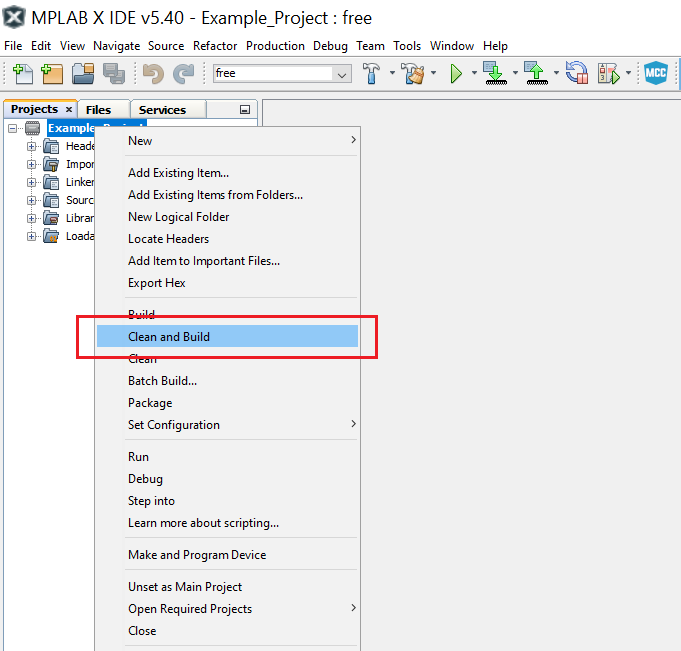
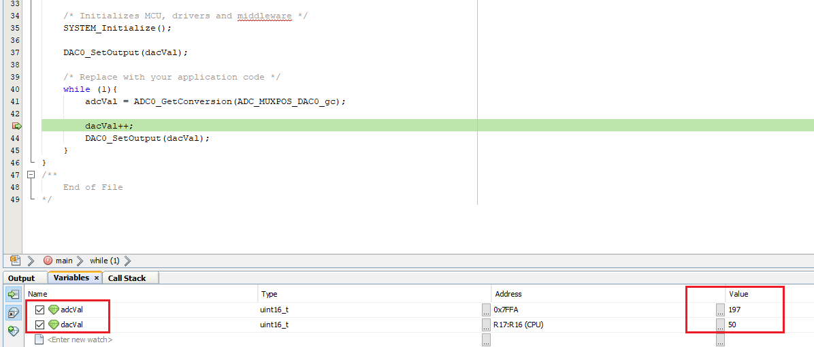

# Reading DAC Internally with ADC

This code example shows how to use the Digital-to-Analog Converter (DAC) to generate an output voltage internally (no pin involved). The Analog-to-Digital Converter (ADC) will read the value. The DAC voltage output will increment by one step every iteration.

## Related Documentation
More details and code examples on the AVR128DA48 can be found at the following links:
- [TB3210-Getting Started with Digital-to-Analog Converter (DAC)](http://ww1.microchip.com/downloads/en/Appnotes/TB3210-Getting-Started-with-DAC-90003210A.pdf)
- [AVR128DA48 Product Page](https://www.microchip.com/wwwproducts/en/AVR128DA48)
- [AVR128DA48 Code Examples on GitHub](https://github.com/microchip-pic-avr-examples?q=avr128da48)
- [AVR128DA48 Project Examples in START](https://start.atmel.com/#examples/AVR128DA48CuriosityNano)

## Software Used
- MPLAB® X IDE 5.40 or newer [(microchip.com/mplab/mplab-x-ide)](http://www.microchip.com/mplab/mplab-x-ide)
- MPLAB® XC8 2.30 or a newer compiler [(microchip.com/mplab/compilers)](http://www.microchip.com/mplab/compilers)
- MPLAB® Code Configurator (MCC) 4.0.1 or newer [(microchip.com/mplab/mplab-code-configurator)](https://www.microchip.com/mplab/mplab-code-configurator)
- MPLAB® Code Configurator (MCC) Device Libraries 8-bit AVR® MCUs 2.5.0 or newer [(microchip.com/mplab/mplab-code-configurator)](https://www.microchip.com/mplab/mplab-code-configurator)
- AVR-Dx 1.4.75 or newer Device Pack

## Hardware Used
- AVR128DA48 Curiosity Nano [(DM164151)](https://www.microchip.com/Developmenttools/ProductDetails/DM164151)

## Setup

The AVR128DA48 Curiosity Nano Development Board is used as test platform.

 

The following configurations must be made for this project:

System clock: 3.33 MHz 

DAC0:
-   Enabled

ADC0:
-   Configure ADC in 12-bit mode
-   Use CLK_PER divided by four as clock source
-   Enabled

VREF:
-   2.048V reference selected for ADC
-   2.048V reference selected for DAC

## Operation

1.  Connect the board to the PC.

2.  Open the Reading_DAC_Internally_with_ADC.X project in MPLAB® X IDE.

3.  Set the Reading_DAC_Internally_with_ADC.X project as main project. Right click on the project in the **Projects** tab and click **Set as Main Project**.

 

4.  Clean and build the Reading_DAC_Internally_with_ADC.X project. Right click on the **Reading_DAC_Internally_with_ADC.X** project and select **Clean and Build**.

 

5.  Select the **AVR128DA48 Curiosity Nano** in the Connected Hardware Tool section of the project settings:

- Right click on the project and click **Properties**
- Click on the arrow under the Connected Hardware Tool
- Select the **AVR128DA48 Curiosity Nano** (click on the **SN**), click **Apply** and then click **OK**:

 

6.  Program the project to the board. Right click on the project and click **Make and Program Device**.

 

## Demo

The theoretical results for `dacVal = 50` are presented below:

 

The practical results are obtained using the Debug mode:

 

## Summary

This code example shows how to read the DAC output internally with the help of the ADC peripheral.